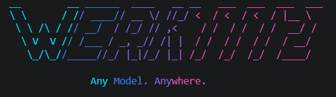

# Werk1112

<p align="center">
  
</p>

Werk1112 is a local-first, multimodal AI inference router written in Rust.

It normalizes, validates, estimates, routes, and executes text, image, video, and audio inference through one stable CLI and HTTP service.

Applications target Werk1112. 

Werk1112 targets inference backends.

Modern AI applications should not need to care whether a model executes through llama.cpp, vLLM, Candle, MLX, or another runtime.

Werk1112 abstracts runtime selection while remaining predictable, transparent, and local-first.

## Project Website

The GitHub Pages landing page lives in `docs/`. To publish it, enable GitHub Pages for this repository with Source `Deploy from a branch`, Branch `main`, and Folder `/docs`.

## Why Werk1112?

Applications should depend on a stable AI runtime, not on individual inference engines.

Werk1112 provides a single runtime abstraction for model management, backend selection and inference while remaining compatible with existing AI tooling.

## What Werk1112 Is

Werk1112 is infrastructure for running local models with predictable routing:

- native CLI workflows for chat, image, video, audio, model management, and serving
- a managed model store for copied local models and pulled Hugging Face repositories
- a runtime planner that chooses between llama.cpp server, vLLM, ONNX Runtime, Candle, and MLX based on model format and requested backend
- an OpenAI-compatible and Werk-native HTTP API for chat and media inference
- a stable runtime abstraction for local AI applications

Werk1112 does not ship a built-in GUI. CLI chat is a first-class workflow, and graphical interfaces can be provided by any client compatible with the OpenAI API.

## What Werk1112 Is Not

Werk1112 is intentionally narrow. It is not an agent framework, a node/workflow engine such as ComfyUI, a sandbox manager, IDE integration layer, or enterprise control plane.

Werk1112 intentionally focuses on model management, runtime selection and inference. Higher-level concerns belong in applications built on top of the runtime, not inside it.

## Product Scope

Werk1112 is responsible for:

- model import and model store management
- model listing and inspection
- backend and runtime selection
- local and companion-runtime inference
- OpenAI-compatible model/chat shapes plus OpenAI-inspired, Werk-native media
  and job endpoints
- CLI `chat`, `image`, `video`, `audio`, and `serve` workflows
- workload estimates, parameter provenance, runtime plans, outputs, and persisted jobs

Werk1112 is not responsible for:

- agent orchestration
- long-running task planning
- sandbox orchestration
- workflow modelling
- IDE integrations
- enterprise management planes

This narrow scope keeps the runtime predictable, composable and easy to integrate into other applications.

## Design Philosophy

Werk1112 deliberately separates model management, runtime selection and inference from higher-level application logic.

Instead of becoming another monolithic AI platform, Werk1112 focuses on doing one job well: providing a reliable runtime abstraction for local AI workloads.

The goal is to let applications depend on a stable runtime abstraction instead of coupling themselves to backend-specific inference engines.

Werk1112 composes inference runtimes. It does not compete with them.

## Status

The project focuses on stability, predictable runtime behaviour and long-term compatibility rather than rapidly expanding feature scope.

Current capabilities include:

- Release artifacts are universal runtime-router binaries, one binary per supported OS/architecture, with platform accelerator support compiled in.
- Installers install only Werk1112; they do not install models, CUDA, ROCm, Metal, MLX, vLLM, llama.cpp, ONNX Runtime, Python, Rust, Cargo, or other runtime dependencies.
- Backend acceleration is selected at runtime from compiled support, host system capabilities, and installed companion runtimes.
- CPU-only, CUDNN, MKL, Burn, and legacy llama.cpp remain explicit source/developer build choices.
- `/v1/models` returns OpenAI-style summaries of installed models. Use
  `werk inspect MODEL` for the full manifest.
- `/v1/chat/completions` accepts OpenAI-style chat requests.
- Typed image, video, audio, speech, and job requests share the same inference
  resolver, estimator, planner, parameter policy, and output store as their CLI
  counterparts.
- Media repositories can always be imported, inspected, and estimated.
  Execution uses the included Python companion protocol and additionally
  requires Python plus the task-specific packages reported by `werk doctor`;
  the bundled adapter is embedded as the default fallback.
- Streaming uses `text/event-stream` with `chat.completion.chunk` payloads and a final `data: [DONE]`.
- API streaming deltas are buffered into small text chunks instead of emitting every generated token as its own event.
- CLI chat streams decoded token-pieces by default so the answer appears progressively in the terminal.
- Local GGUF and safetensors model imports are copied into a managed model store.
- Hugging Face pulls use `git clone` for now, so install `git` and `git-lfs` for real model repos.

Current generation support is selected through the Werk1112 Runtime Planner. Werk1112 is an inference router, not a Candle wrapper: GGUF uses a persistent llama.cpp `llama-server` process as the hot path, so decode, sampling, KV cache, logits, and GPU execution stay inside llama.cpp. Supported HF safetensors directories prefer vLLM on CUDA, may use vLLM ROCm through `--backend rocm`, and use Candle as the compatibility fallback. MLX model directories can run through an external `mlx-lm` backend.

## Install

End users should prefer the installer scripts and prebuilt release artifacts. The installers are binary-only: they install the Werk1112 CLI binary and do not require Rust or Cargo. They do not install models, CUDA, ROCm, Metal, MLX, vLLM, llama.cpp, ONNX Runtime, Python, or other runtime dependencies. Companion runtimes are used only if already installed or provisioned later by Werk commands.

### Linux / macOS

```bash
sh -c "$(curl -fsSL https://raw.githubusercontent.com/philipbodenbach/werk1112/main/scripts/install.sh)"
```

Install a specific version:

```bash
WERK_VERSION=1.0.0 sh -c "$(curl -fsSL https://raw.githubusercontent.com/philipbodenbach/werk1112/main/scripts/install.sh)"
```

Custom install directory:

```bash
WERK_INSTALL_DIR="$HOME/bin" sh -c "$(curl -fsSL https://raw.githubusercontent.com/philipbodenbach/werk1112/main/scripts/install.sh)"
```

### Windows PowerShell

```powershell
irm https://raw.githubusercontent.com/philipbodenbach/werk1112/main/scripts/install.ps1 | iex
```

Install a specific version:

```powershell
$env:WERK_VERSION="1.0.0"; irm https://raw.githubusercontent.com/philipbodenbach/werk1112/main/scripts/install.ps1 | iex
```

Add the install directory to the user PATH:

```powershell
$env:WERK_ADD_TO_PATH="1"; irm https://raw.githubusercontent.com/philipbodenbach/werk1112/main/scripts/install.ps1 | iex
```

Source builds remain available for developers in the Build section.

## Uninstall

The uninstaller removes the Werk1112 CLI and can optionally remove the model store and API key file. It does not remove model data or API keys automatically without confirmation.

### Linux / macOS

```bash
sh -c "$(curl -fsSL https://raw.githubusercontent.com/philipbodenbach/werk1112/main/scripts/uninstall.sh)"
```

### Windows PowerShell

```powershell
irm https://raw.githubusercontent.com/philipbodenbach/werk1112/main/scripts/uninstall.ps1 | iex
```

## Quick Start

After installing `werk`, import or pull a model. The installer does not download models.

```bash
werk import /path/to/model-dir --name local-model
werk pull org/model-repo --name hf-model
```

For gated Hugging Face models, accept the model conditions on Hugging Face first, then run `werk auth huggingface login` or set `HF_TOKEN` before pulling or remote-estimating.

Start an interactive terminal chat or execute a media task:

```bash
werk estimate local-model
werk estimate org/model-repo
werk chat local-model
werk image generate flux-dev --prompt "an abandoned orbital station"
werk video animate wan-i2v --image station.png --prompt "slow orbital drift"
werk audio speak speech-model --text "Systems nominal."
```

Start the HTTP server. Authentication is enabled by default; the key generator
prints the value that clients must use:

```bash
werk auth api-key generate
export WERK_API_KEY='<paste the generated key>'
werk serve --model local-model
```

Then point OpenAI-compatible chat clients at:

```text
http://127.0.0.1:11434/v1
```

For a loopback-only development server without authentication, use
`werk serve --model local-model --allow-unauthenticated`.

## Image, Video, and Audio Inference

Werk provides first-class typed inference for generated media. A request names
one installed model and one canonical task; Werk then resolves effective
parameters, validates model/runtime support, estimates memory, selects a
runtime, executes locally, and persists the output with its metadata.

The main CLI workflows are:

```bash
# Image generation and editing
werk image generate flux-dev --prompt "an abandoned orbital station" \
  --width 1024 --height 1024 --steps 28
werk image edit flux-fill --image station.png --prompt "restore the solar array"

# Video generation and image-to-video
werk video generate wan-t2v --prompt "a quiet lunar sunrise" \
  --frames 81 --fps 16
werk video animate wan-i2v --image station.png --prompt "slow camera orbit"

# Audio/music generation, speech synthesis, and transcription
werk audio generate musicgen --prompt "cinematic analogue synthwave"
werk audio speak speech-model --text "Systems nominal."
werk audio transcribe whisper --input interview.wav
```

Before execution, inspect and estimate the same typed contract:

```bash
werk inspect flux-dev
werk parameters flux-dev --backend auto --json
werk estimate flux-dev --task image-generation \
  --width 1024 --height 1024 --steps 28
werk doctor --model flux-dev --task image-generation
```

Werk includes an offline media companion adapter for compatible local Diffusers
and Transformers models. Launcher discovery honors `WERK_MEDIA_COMPANION`,
`WERK_MEDIA_PYTHON`, and repository scripts before using the embedded adapter
fallback. The companion never downloads weights or installs packages; Python,
Torch, model-framework packages, and required codecs must already be available.
Image, video, audio/music, TTS, and ASR have generic adapters. Song
continuation/variation, voice conversion, stems, and audio enhancement are
represented by the request/schema/planner contract but are not yet generically
executable.

The HTTP service exposes the same media pipeline through synchronous image
routes, persisted video/audio jobs, synchronous or asynchronous TTS, JSON
transcription, parameter/capability discovery, and authenticated output
downloads. See the [HTTP API](#http-api) examples below and the full
[media inference reference](docs/media-inference.md).

## Format Support

| Format | Typical Use | Import/List/Inspect | Backend Status |
| --- | --- | --- | --- |
| Safetensors | Hugging Face training/fine-tuning standard | Yes | vLLM CUDA for supported text architectures; vLLM ROCm through `--backend rocm`; Transformers compatibility for raw ChatGLM/GLM repos; Candle CUDA/CPU/Metal compatibility fallback; MLX through `mlx-lm` when selected; Werk media companion for compatible media repositories |
| GGUF | llama.cpp, Ollama, LM Studio, CPU inference | Yes | CUDA/ROCm/Vulkan/CPU through persistent llama.cpp server; Candle is legacy/fallback only |
| PyTorch (`.pt`, `.pth`, `pytorch_model.bin`) | Training, research, media checkpoints | Yes | Werk media companion for compatible local Diffusers/Transformers media models; otherwise catalog/import only |
| ONNX (`.onnx`) | Framework-independent inference | Yes | ONNX Runtime CUDA/ROCm/CPU when a runner is available |
| MLX (`.npz`, MLX-style dirs) | Apple Silicon / MLX-LM | Yes | Implemented through external `mlx-lm` backend when configured |
| TensorRT Engine (`.engine`, `.plan`) | NVIDIA-optimized inference | Yes | Catalog/import only; no generation backend yet |
| OpenVINO IR (`.xml` + `.bin`) | Intel CPUs, GPUs, NPUs | Yes | Catalog/import only; no generation backend yet |
| TensorFlow (`.ckpt`, `.pb`) | TensorFlow ecosystem | Yes | Catalog/import only; no generation backend yet |
| CoreML (`.mlmodel`, `.mlpackage`) | iOS/macOS deployment | Yes | Catalog/import only; no generation backend yet |

Repository layout is independent of file format. Manifests distinguish
`single_file`, `gguf`, `transformers`, `diffusers`, `mlx`, `onnx_bundle`,
`tensorrt_engine`, and `custom`. Diffusers repositories are recognized through
`model_index.json` and component directories such as `transformer/`, `unet/`,
`vae/`, `scheduler/`, and the text encoders/tokenizers—not merely by a filename
extension.

## Werk1112 Runtime Planner

Werk routes by requested backend, model format, model architecture, input
capabilities, compiled features, and discovered companion runtimes.
`--backend auto` may fall back to CPU. Text/chat GPU routes are strict about
their requested accelerator. For typed media, `cpu`, `cuda`, `rocm`, and
`metal` map to companion accelerator requirements; the included companion has
no Vulkan adapter.

| Runtime | Formats | Accelerators | VLM | Status |
| --- | --- | --- | --- | --- |
| llama.cpp server | GGUF | CUDA, ROCm/HIP, Vulkan, CPU | Pending mmproj/image wiring | Primary GGUF hot path |
| vLLM | Selected HF safetensors | CUDA, ROCm through `--backend rocm` | Backend-dependent | Preferred route for supported HF safetensors architectures |
| ONNX Runtime | Managed ONNX artifacts/direct ONNX when selected | CUDA, ROCm, CPU | No | Explicit opt-in route |
| Candle | GGUF legacy, safetensors | CUDA, Metal, CPU | No | Implemented for selected architectures |
| Transformers compatibility | Raw ChatGLM/GLM safetensors | PyTorch-selected device (`cuda`, `mps`, or `cpu`) | No | Uses local Hugging Face custom code with `trust_remote_code=True` |
| MLX | MLX dirs, selected HF safetensors | Apple Silicon / MLX | Backend-dependent | Implemented through `mlx-lm` when configured |
| Werk media companion | Safetensors/PyTorch weights in compatible Diffusers/Transformers repositories and compatible single-file media checkpoints | CUDA, ROCm, Metal/MPS, CPU | N/A | Offline/local-only adapter for image, video, audio, TTS, and ASR; task support depends on installed optional packages and model metadata |

### Media Companion Task Support

All canonical media tasks can be represented in schema-v2 manifests, inspected,
validated, and estimated. Generic companion execution is currently:

| Task group | Catalog / inspect / estimate | Generic companion execution |
| --- | --- | --- |
| Image generation, editing, variation, inpainting, outpainting, upscaling | Yes | Diffusers pipeline/model dependent |
| Video generation, image-to-video, video-to-video, inpainting, extension, upscaling, frame interpolation | Yes | Diffusers plus image/video codec dependencies |
| Audio and music generation | Yes | Diffusers or Transformers pipeline/model dependent |
| Text-to-speech | Yes | Transformers TTS pipeline/model dependent |
| Speech-to-text and translation | Yes | Transformers ASR pipeline/model dependent |
| Song continuation and variation | Yes | Prepared; no generic adapter yet |
| Voice conversion | Yes | Prepared; no generic adapter yet |
| Stem generation and separation | Yes | Prepared; no generic adapter yet |
| Audio enhancement | Yes | Prepared; no generic adapter yet |

The bundled adapter is embedded in the Werk binary and uses a one-request
local-only process protocol; an explicit external companion can replace it.
Neither variant downloads weights or installs packages. Image execution needs
Python, Torch, Diffusers, and Pillow. Video additionally needs NumPy and
`imageio` for video I/O; MP4 encoding normally needs an imageio-compatible
encoder backend such as `imageio-ffmpeg`. Generative audio needs Torch and
NumPy plus Diffusers or Transformers; TTS and ASR need Torch, Transformers, and
NumPy. FLAC/OGG output additionally needs `soundfile`; WAV has a direct writer.
The exact model pipeline can still reject a request when it is loaded.

See [Media inference](docs/media-inference.md) for the canonical tasks,
parameter contract, output formats, environment variables, and current
limitations.

Planner policy:

- GGUF routes to llama.cpp server CUDA, optional ROCm/HIP when detected for auto, Vulkan, or CPU first. Candle GGUF is legacy fallback/debug only.
- Safetensors routing is format-based: raw ChatGLM/GLM repositories use the Transformers compatibility route; otherwise auto/CUDA prefer vLLM CUDA for supported architectures, then Candle compatibility fallback. Auto may use Candle CPU only after preferred GPU runtimes reject.
- `--backend vllm` is a strict vLLM-only safetensors route with the existing default vLLM accelerator behavior. ROCm-specific vLLM is selected through `--backend rocm`, and the probe requires a ROCm/HIP-capable PyTorch stack or an explicitly marked ROCm remote endpoint.
- For text/chat candidates, `--backend cpu`, `cuda`, `rocm`, and `vulkan` are
  strict accelerator routes, while `candle`, `onnx`, `vllm`, `mlx`, and the
  llama routes select their matching runtime families.
- For media candidates, `cpu`, `cuda`, `rocm`, and `metal` constrain the
  companion accelerator. Other backend labels such as `vulkan` or `candle` do
  not name media adapters and may be bypassed by the default `backend` fallback
  policy; `--fallback-policy none` rejects mismatched candidates.
- Image requests filter to VLM-capable runtimes before loading; Candle text routes reject image input.
- `--debug` exposes candidate decisions for chat/run and
  `werk backend doctor --debug`. For media, use
  `werk doctor --model MODEL --task TASK` for plan/rejection details and
  `werk parameters MODEL --json` for parameter support.
- Media plans evaluate model task, runtime task, layout, family/architecture probe, availability, accelerator, explicitly set parameters, and workload fit. Backend fallback and execution degradation are separate. Smaller models, stronger quantization, lower resolution, fewer frames, and shorter duration are recommendations only and are never applied silently.

## Build

Release builds use one target-specific Cargo alias per deployed end-user artifact. Those aliases build with `--no-default-features` and the target `release-*` feature bundle, producing universal runtime-router binaries with the platform accelerator path compiled in. Linux and Windows artifacts compile CUDA support; macOS Apple Silicon artifacts compile Metal support. External/server backends such as llama.cpp server, vLLM, ONNX Runtime, MLX, and Transformers compatibility are discovered at runtime from the host system and installed companion runtimes. Users can choose the active backend with `--backend`.

```bash
cargo install --path . --locked --force
```

Use `--locked` for source installs. Without it, Cargo may resolve newer crates than the checked-in lockfile and require a different binding surface than the one this repo was verified with.

If a linker error still mentions a feature that is no longer enabled, such as `-lnccl` or `llama_cpp_sys`, clear the release build artifacts, not the global Cargo registry:

```bash
cargo clean --release
```

For a portable CPU-only development binary, opt out of default features:

```bash
cargo check --locked --no-default-features
cargo build-cpu
```

Target release builds:

```powershell
cargo build-windows
```

```bash
cargo build-linux
cargo build-macos-apple-silicon
```

Run target release aliases on the matching build OS/toolchain when cross-compilation is unavailable. In practice:

- Run `cargo build-windows` from native Windows Developer PowerShell with the MSVC Rust toolchain.
- Run `cargo build-linux` from Linux or WSL.
- Run `cargo build-macos-apple-silicon` on Apple Silicon macOS.

Do not use WSL to produce the Windows artifact. WSL can build the Linux artifact.

The underlying Cargo aliases expand to normal Cargo target builds:

```text
cargo build-windows              -> Windows CUDA/MSVC env overrides + no default features + x86_64-pc-windows-msvc + release-windows
cargo build-linux                -> no default features + x86_64-unknown-linux-gnu + release-linux
cargo build-macos-apple-silicon  -> no default features + aarch64-apple-darwin + release-macos-apple-silicon
```

Cargo aliases are subcommands, so the command is `cargo build-windows`, not `cargo build windows`. The Windows alias includes command-local Cargo env overrides for the CUDA 13.3/MSVC preprocessor compatibility path; those overrides are not global and do not apply to Linux or macOS aliases.

If a target build fails with `E0463` / `can't find crate for core` or many dependencies fail immediately, the Rust standard library for that target is not installed in the active toolchain. The checked-in `rust-toolchain.toml` lists the supported release targets, but native target OS builds may still be required when cross-compilation tooling is unavailable.

Release feature bundles:

| Bundle | Compiled into the Werk binary | Runtime-discovered companion routes |
| --- | --- | --- |
| `release-windows` | Universal router, Candle CPU, Candle CUDA | llama.cpp server CUDA/ROCm/Vulkan/CPU, vLLM CUDA/ROCm, ONNX Runtime CUDA/ROCm/CPU, Transformers compatibility when available on the host |
| `release-linux` | Universal router, Candle CPU, Candle CUDA | llama.cpp server CUDA/ROCm/Vulkan/CPU, vLLM CUDA/ROCm, ONNX Runtime CUDA/ROCm/CPU, Transformers compatibility when available on the host |
| `release-macos-apple-silicon` | Universal router, Candle CPU, Candle Metal | llama.cpp server Metal/CPU, MLX, ONNX Runtime CPU, Transformers compatibility when available on the host |

The companion routes are not packaged inside the release archives. The Werk binary contains the router support for them; actual use depends on host-installed runtimes, configured paths, managed backend installs, or remote endpoints.

Raw Cargo equivalents:

```bash
cargo build --release --locked --no-default-features --target x86_64-pc-windows-msvc --features release-windows
cargo build --release --locked --no-default-features --target x86_64-unknown-linux-gnu --features release-linux
cargo build --release --locked --no-default-features --target aarch64-apple-darwin --features release-macos-apple-silicon
```

Target release builds compile the platform accelerator Cargo feature into the artifact. That means Linux and Windows release builders need a working CUDA build environment, and Apple Silicon release builders need the macOS Metal-capable toolchain. The installers still install only the Werk1112 CLI; they do not install CUDA, ROCm, Python, models, or companion runtimes. At runtime, Werk uses compiled Candle support plus available host companion backends and follows the planner fallback policy when a backend is unavailable. For a CUDA-enabled source build, point Cargo at the intended installed toolkit:

```bash
export CUDA_HOME=/usr/local/cuda-13.0
export CUDA_ROOT=/usr/local/cuda-13.0
export CUDA_PATH=/usr/local/cuda-13.0
export CUDA_TOOLKIT_ROOT_DIR=/usr/local/cuda-13.0
export PATH="$CUDA_HOME/bin:$PATH"
export LD_LIBRARY_PATH="$CUDA_HOME/lib64:${LD_LIBRARY_PATH:-}"

nvcc --version
cargo install --path . --locked --force --features cuda
```

If the CUDA build then fails because NVML cannot query the GPU, set the compute capability manually. For example, an RTX 30xx/Ampere `sm_86` GPU uses:

```bash
export CUDA_COMPUTE_CAP=86
cargo install --path . --locked --force --features cuda
```

For a CUDA-enabled local install with an explicit feature selection, make sure the newer CUDA toolkit is first:

```bash
sudo apt-get update
sudo apt-get install -y clang libclang-dev

export CUDA_HOME=/usr/local/cuda-13.0
export CUDA_ROOT=/usr/local/cuda-13.0
export CUDA_PATH=/usr/local/cuda-13.0
export CUDA_TOOLKIT_ROOT_DIR=/usr/local/cuda-13.0
export PATH="$CUDA_HOME/bin:$PATH"
export LD_LIBRARY_PATH="$CUDA_HOME/lib64:${LD_LIBRARY_PATH:-}"

cargo install --path . --locked --force --features cuda
```

If you are building the explicit legacy in-process llama.cpp FFI CUDA backend inside WSL with Ubuntu's CUDA 11.5 package, `nvcc` may fail inside `llama_cpp_sys` with errors from `/usr/include/c++/11/bits/std_function.h`. That means CUDA 11.5 is using GCC 11 as the host compiler. The repository Cargo config defaults Linux CUDA builds to GCC/G++ 10, so install those once:

```bash
sudo apt-get install -y gcc-10 g++-10

cargo install --path . --locked --force --features llama-legacy-cuda
```

To override that default, set `CC_x86_64_unknown_linux_gnu` or `CXX_x86_64_unknown_linux_gnu` in your shell before running Cargo.

If the build fails in `candle-kernels` with `fatal error: cuda_fp8.h: No such file or directory`, the active CUDA toolkit is too old for Candle CUDA. Install a newer CUDA toolkit and make sure its `bin` and `include` directories come before Ubuntu's `/usr` CUDA package. For a CPU-only development build, use `cargo install --path . --locked --force --no-default-features`.

Native Windows CUDA source build / Developer PowerShell:

1. Install Rust for Windows with `rustup`.
2. Install Visual Studio Build Tools with the `Desktop development with C++` workload.
3. Install Git, Git LFS, LLVM/libclang, and a Windows CUDA Toolkit.
4. Open native Windows Developer PowerShell, not a WSL shell.
5. Build from a Windows filesystem path such as `C:\dev\werk1112`, not from `\\wsl$\...`.

If `rustup default stable-x86_64-pc-windows-msvc` says the toolchain may not be able to run on this system, the command is being run from WSL/Linux. Close that shell and run the Windows source build from PowerShell on Windows.

If PowerShell says `rustup` was not recognized, Rust is not installed for Windows or `%USERPROFILE%\.cargo\bin` is not on `PATH`. Install Rust on Windows, reopen PowerShell, and verify `rustup --version`.

If the PowerShell prompt starts in `\\wsl.localhost\...`, move or clone the project into a Windows path before building:

```powershell
cd C:\dev
git clone <repo-url> werk1112
cd C:\dev\werk1112
```

Build a native Windows CUDA source binary:

```powershell
cd C:\dev\werk1112

rustup default stable-x86_64-pc-windows-msvc
git lfs install
nvidia-smi

$vswhere = Join-Path ${env:ProgramFiles(x86)} "Microsoft Visual Studio\Installer\vswhere.exe"
$vsInstall = & $vswhere -latest -products * -requires Microsoft.VisualStudio.Component.VC.Tools.x86.x64 -property installationPath
if (-not $vsInstall) {
  throw "Visual Studio C++ build tools not found. Install Visual Studio Build Tools with Desktop development with C++."
}

Import-Module (Join-Path $vsInstall "Common7\Tools\Microsoft.VisualStudio.DevShell.dll")
Enter-VsDevShell -VsInstallPath $vsInstall -SkipAutomaticLocation -DevCmdArguments "-arch=x64 -host_arch=x64"

$cudaRoot = "C:\Program Files\NVIDIA GPU Computing Toolkit\CUDA"
$env:CUDA_HOME = Get-ChildItem $cudaRoot -Directory |
  Sort-Object Name -Descending |
  Select-Object -First 1 -ExpandProperty FullName

if (-not $env:CUDA_HOME) {
  throw "CUDA Toolkit not found under $cudaRoot. Install the CUDA Toolkit, not only the NVIDIA driver."
}

$env:CUDA_ROOT = $env:CUDA_HOME
$env:CUDA_PATH = $env:CUDA_HOME
$env:CUDA_TOOLKIT_ROOT_DIR = $env:CUDA_HOME
$env:CUDA_COMPUTE_CAP = "86"
$env:Path = "$env:CUDA_HOME\bin;$env:Path"
$env:CL = "/Zc:preprocessor"
$env:NVCC_PREPEND_FLAGS = "-DCCCL_IGNORE_MSVC_TRADITIONAL_PREPROCESSOR_WARNING"

if (-not (Test-Path "$env:CUDA_HOME\bin\nvcc.exe")) {
  throw "nvcc.exe not found in $env:CUDA_HOME\bin. Check the CUDA Toolkit installation."
}

where.exe cl
$clPath = (Get-Command cl.exe).Source
if ($clPath -notmatch "\\Hostx64\\x64\\cl\.exe$") {
  throw "MSVC is not in x64 mode. Re-run Enter-VsDevShell with -arch=x64 -host_arch=x64, or open the x64 Native Tools shell."
}
$env:NVCC_CCBIN = Split-Path $clPath
cl
where.exe nvcc
nvcc --version
cargo build --release --locked --features cuda
```

CUDA 13.3 and newer on Windows may fail in `candle-kernels` with a CCCL error that says MSVC is using the traditional preprocessor. `cargo build-windows` and `scripts/build-windows.ps1` set the Windows-only workaround for the release build. Do not carry this workaround into Linux or macOS release builds.

The release binary is written to Cargo's target directory:

```text
target/x86_64-pc-windows-msvc/release/werk.exe
target/x86_64-unknown-linux-gnu/release/werk
target/aarch64-apple-darwin/release/werk
```

Runtime backend setup should be a black box for end users. GGUF execution uses a persistent llama.cpp server backend so the decode loop, sampling, KV cache, logits, and GPU execution stay inside llama.cpp. For vLLM-supported HF safetensors architectures on CUDA, vLLM is tried before Candle. Candle is the compatibility fallback instead of the primary target. In `--backend auto`, Werk skips unavailable runtimes quietly, may provision managed llama.cpp server backends for the platform GGUF hot path, and uses the best working fallback; `--debug` and `werk backend doctor --debug` print detailed probe rejection reasons. Source builds may also use PATH-provided companion runtimes for llama.cpp/ONNX/vLLM; use `werk backend list`, `werk backend doctor --debug`, `werk backend install llama-cuda`, and `werk artifacts build <model>` for local development. `WERK_LLAMA_CTX`, `WERK_LLAMA_BATCH`, `WERK_LLAMA_UBATCH`, and `WERK_LLAMA_MAIN_GPU` are advanced GGUF tuning overrides. `WERK_LLAMA_SERVER_ROCM` can point to a ROCm/HIP llama.cpp server. `WERK_ONNX_RUNTIME_CUDA`, `WERK_ONNX_RUNTIME_ROCM`, `WERK_ONNX_RUNTIME_CPU`, `WERK_ONNX_RUNTIME`, `WERK_ONNX_RUNTIME_BUNDLE_CUDA`, `WERK_ONNX_RUNTIME_BUNDLE_ROCM`, `WERK_ONNX_RUNTIME_BUNDLE_CPU`, and `WERK_ONNX_EXPORTER` are advanced ONNX artifact/runtime overrides. `WERK_VLLM_PYTHON`, `WERK_VLLM_HOST`, `WERK_VLLM_PORT`, `WERK_VLLM_ACCELERATOR=rocm`, `WERK_VLLM_ROCM=1`, and `WERK_VLLM_ARGS` are available for managed and explicit vLLM routes. The MLX backend uses `python3 -m mlx_lm.generate` or `WERK_MLX_PYTHON`. VLM request/image support is compiled into every build; actual multimodal generation depends on the chosen model and backend.

Additional low-level acceleration features are available for custom builds:

```bash
cargo build --release --locked --features mkl
cargo build --release --locked --features candle-cuda
cargo build --release --locked --features cuda,cudnn
```

The top-level `cuda` feature means CUDA support across the proven Werk CUDA paths: Candle CUDA plus the external persistent llama.cpp server route for GGUF. It does not compile the old in-process llama.cpp FFI CUDA backend. It is included by the default `recommended` feature and can still be requested explicitly:

```bash
cargo install --path . --locked --force --features cuda
```

Burn is experimental and absent from normal routing unless compiled with `burn-experimental`. Burn CUDA is available as an explicit developer feature:

```bash
cargo install --path . --locked --force --features burn-cuda
```

`cargo build --release ...` only creates `target/release/werk`; it does not replace the `werk` on your PATH. After a build, run `./target/release/werk ...` or use `cargo install --path . --locked --force --features burn-cuda` to replace `~/.cargo/bin/werk`.

For a custom no-default experimental build that still includes the recommended CUDA/Candle path plus Burn CPU and Burn CUDA:

```bash
cargo install --path . --locked --force --no-default-features --features cuda,burn-cpu,burn-cuda
```

Burn CUDA uses CubeCL, which currently links NCCL through `cudarc`. Install native CUDA and NCCL libraries through the system package manager or provide native `CUDA_HOME`/`NCCL_HOME` paths. Burn does not use Python, pip, or Python site-packages for GPU libraries; Python remains limited to explicit Python runtimes such as vLLM. When `burn-experimental` is compiled, `werk backend doctor --debug` reports whether the binary was compiled with Burn CUDA, whether WSL/Linux is loading a real `libcuda` instead of CUDA stubs, whether `libcudart` and `libnccl` are discoverable, and whether the Burn CUDA tensor smoke test passes. Use the checked-in lockfile for source installs so the CUDA binding surface remains reproducible.

The old in-process llama.cpp FFI CUDA backend is also explicit:

```bash
cargo install --path . --locked --force --features llama-legacy-cuda
```

Normal GGUF CUDA usage does not need that feature. Use `werk backend install llama-cuda` to provision the persistent llama.cpp server backend instead.

The lower-level `candle-cuda` feature is still available for custom builds that only need Candle CUDA without llama.cpp CUDA. `cudnn` builds on Candle CUDA. These features may require CUDA headers such as `cuda_fp8.h`, which are not present in Ubuntu's CUDA 11.5 package.

Build features decide what Candle, llama.cpp, and experimental Burn acceleration support is compiled into the binary. Backend selection is a separate CLI option and is the preferred way to choose how a process runs:

```bash
werk --backend auto chat gemma-2b-it
werk --backend cpu chat gemma-2b-it
werk --backend cuda chat gemma-2b-it
werk --backend rocm chat Qwen3-14B
werk --backend metal chat gemma-2b-it
werk --backend vulkan chat TinyLLama-1B-GGUF
werk --backend mlx chat mlx-model
werk --backend transformers chat THUDM/glm-4-9b-chat
werk --backend candle chat debug-model
werk --backend onnx chat phi-3-mini-4k-instruct
werk --backend vllm chat phi-3-mini-4k-instruct
werk --backend cuda serve --model gemma-2b-it
```

`--backend auto` is format-aware. For GGUF on Windows/Linux it tries llama.cpp server CUDA, includes ROCm/HIP only when a ROCm-specific signal or managed ROCm server is present, then Vulkan, CPU, and Candle legacy GPU/CPU fallback. For raw ChatGLM/GLM safetensors, it uses the Transformers compatibility route so model-provided Hugging Face code and chat templates can run. For other safetensors it tries vLLM for supported CUDA architectures, then Candle CUDA, then Candle CPU as an auto-only fallback. Normal chat/run output skips noisy unavailable runtime diagnostics; use `--debug` or `werk backend doctor --debug` for attempted runtimes and probe rejection reasons. On Apple Silicon it prefers MLX for MLX models and may use MLX or Candle for safetensors depending on availability.

For GGUF models, `--backend cuda`, `--backend rocm`, `--backend vulkan`, and `--backend cpu` use the matching persistent llama.cpp server backend when that server is available. For safetensors models, CUDA tries vLLM CUDA for supported architectures and then Candle CUDA; ROCm tries only vLLM ROCm and verifies the discovered vLLM environment is ROCm/HIP-capable. CPU uses Candle CPU unless the model needs the raw ChatGLM/GLM compatibility route. `--backend transformers` explicitly selects the compatibility route and requires a Python environment with `torch`, `transformers`, and usually `accelerate`; set `WERK_TRANSFORMERS_PYTHON`, `WERK_TRANSFORMERS_DEVICE`, or `WERK_TRANSFORMERS_DTYPE` to override discovery. `--backend onnx` is strict ONNX Runtime only: it never falls back to Candle and fails with actionable diagnostics if no runner is installed. `--backend vllm` remains a strict vLLM-only route with the existing default vLLM accelerator behavior and fails clearly if vLLM is missing, broken, or cannot load the model. Explicit GPU backend requests do not silently fall back to CPU; they fail with an actionable error if the requested runtime is unavailable. `--backend candle` is available for debugging or fallback verification. `--device` remains as a Candle-only compatibility override, but `--backend` is what end users should use.

## Packaging Release Artifacts

Release artifacts are written to `releases/`.

```bash
./scripts/package-release.sh linux
./scripts/package-release.sh windows
./scripts/package-release.sh macos
./scripts/package-release.sh all
```

Artifacts:

```text
releases/werk1112-v<VERSION>-linux-x86_64.tar.gz
releases/werk1112-v<VERSION>-windows-x86_64.zip
releases/werk1112-v<VERSION>-macos-aarch64.tar.gz
```

Each artifact has a `.sha256` checksum file. Release artifacts are universal runtime-router binaries, one per supported OS/architecture, with the platform accelerator path compiled in. Build them on the matching target OS/toolchain when cross-compilation is unavailable.

## Model Store

The model store is resolved in this order:

1. `WERK_HOME`
2. `$XDG_DATA_HOME/werk1112`
3. Native Windows: `%LOCALAPPDATA%\werk1112`
4. Native Windows fallback: `%USERPROFILE%\AppData\Local\werk1112`
5. Unix fallback: `~/.local/share/werk1112`

Models, optimized artifacts, generated outputs, and jobs are separate:

```text
~/.local/share/werk1112/
├── models/<model-id>/
│   ├── manifest.json
│   └── files/...
├── artifacts/<model-id>/...
├── outputs/<result-id>/
│   ├── metadata.json
│   └── generated files...
└── jobs/<job-id>.json
```

Each inference result owns one directory. Individual output IDs use
`<result-id>-<index>` and are resolved through that directory's
`metadata.json`.

On native Windows, the same model is saved here by default:

```text
%LOCALAPPDATA%\werk1112\models\TinyLLama-1B-GGUF\
```

Schema-v2 `manifest.json` contains source, format, family, architecture,
repository layout, typed tasks and modalities, first-class components,
precision/quantization, detected defaults and constraints, checksums, runtime
hints, and optimized-artifact metadata. Schema-v1 manifests remain readable and
are enriched in memory from their repository contents.

Output retention defaults to 30 days and 20 GiB and only ever removes children
of `outputs/`; model data is never part of retention. Override the limits with
`WERK_OUTPUT_RETENTION_SECONDS` and `WERK_OUTPUT_MAX_BYTES`.

For GGUF repositories that contain many quantizations, new imports prefer a balanced `Q4_K_M` file when it is present instead of taking the first filename alphabetically. The selected file is stored in `manifest.json` as `model_path`, and both `chat` and `serve` use that selected file.

## CLI

Install the CLI from this checkout with the recommended runtime stack:

```bash
cargo install --path . --locked
```

From another directory, pass the project path with `--path`:

```bash
cargo install --path /path/to/werk1112 --locked
```

After install, use the command directly:

```bash
werk --help
werk serve --help
```

During development, you can also run the local CPU-only binary without installing:

```bash
cargo run --no-default-features -- <command>
```

Generate an API key and start the server:

```bash
werk auth api-key generate
werk serve
```

`serve` exposes OpenAI-compatible model/chat routes and Werk media, discovery,
output, and job routes. `/v1/models` returns summaries of all installed models;
use `werk inspect MODEL` for a full manifest. Media requests require their JSON
`model` field.

Set a default model for chat requests that omit `model`:

```bash
werk serve --model gemma-2b-it
```

The default address is:

```text
http://127.0.0.1:11434
```

Override address:

```bash
werk serve --host 0.0.0.0 --port 11434
```

Generate a persistent API key file for clients such as Open WebUI:

```bash
werk auth api-key generate
```

By default this creates `~/.config/werk1112/api-keys.toml`. `werk serve` requires API key auth by default and loads that file automatically. To create or use a different file:

```bash
werk auth api-key generate --path /path/to/api-keys.toml
werk serve --api-keys /path/to/api-keys.toml
```

Clients should send the generated value as an OpenAI-compatible bearer token:

```text
Authorization: Bearer <key>
```

For a local development server with no authentication:

```bash
werk serve --allow-unauthenticated
```

Import a local model file or directory. Files are copied into the managed model store:

```bash
werk import /path/to/model-dir --name llama-local
```

Pull from Hugging Face:

```bash
werk pull org/model-repo --name model-local
```

Gated Hugging Face repositories require access before Git can clone their files. Open the model page in a browser, accept the model conditions, then authenticate Werk:

```bash
werk auth huggingface login
werk auth huggingface status
```

Werk also accepts tokens from `HF_TOKEN`, `HUGGING_FACE_HUB_TOKEN`, or the standard Hugging Face CLI token cache. Use `werk auth huggingface logout` to remove the token stored by Werk.

Pull one file from a Hugging Face repository, useful for GGUF repos that contain many quantizations:

```bash
werk pull TheBloke/TinyLlama-1.1B-Chat-v1.0-GGUF \
  --file tinyllama-1.1b-chat-v1.0.Q4_K_M.gguf \
  --name TinyLlama-1B-GGUF
```

Pull shows live status for each phase. The first phase clones Git metadata with `GIT_LFS_SKIP_SMUDGE=1`; the second phase runs `git lfs pull` and shows `downloading` with either Git LFS percent/speed or a running local bytes/s estimate while Git LFS is quiet. After the download completes, the CLI shows an import step while files are copied into the managed model store.

Build, list, or rebuild optimized runtime artifacts for a safetensors model:

```bash
werk artifacts build phi-3-mini-4k-instruct
werk artifacts list phi-3-mini-4k-instruct
werk artifacts rebuild phi-3-mini-4k-instruct
```

When an explicit ONNX Runtime route is selected and no ready ONNX artifact exists, Werk attempts the same managed artifact build automatically. Auto SafeTensors routing uses vLLM/Candle and does not require ONNX artifacts. Set `WERK_ONNX_EXPORTER` to a custom exporter binary, or install `optimum-cli` / `optimum.exporters.onnx` for the default exporter path.

Remove an installed model from Werk's managed store. This deletes the managed copy under `WERK_HOME`; it does not delete the original local import source or any upstream Hugging Face repository:

```bash
werk remove model-local
werk rm model-local
```

List installed models:

```bash
werk list
werk list --task image-generation --layout diffusers
werk list --input-modality audio --output-modality text
werk list --family flux --layout diffusers --json
```

Inspect a model manifest:

```bash
werk inspect llama-local
```

Estimate model size or a concrete inference workload before starting:

```bash
# Legacy model-fit estimate: installed models or remote Hugging Face repositories
werk estimate llama-local
werk estimate llama-local --verbose
werk estimate llama-local --json
werk estimate org/model-repo
werk estimate org/model-repo --file model.Q4_K_M.gguf --verbose

# Workload Estimate v2: installed model plus canonical task
werk estimate flux-dev --task image-generation --width 1024 --height 1024 --steps 28
werk estimate wan-i2v --task image-to-video --width 832 --height 480 --frames 81
```

These are intentionally different modes:

- Without `--task`, the legacy model-fit estimator counts selected weights,
  runtime overhead, and an estimated text KV cache. It compares the total with
  detected system memory and reports `ok`, `warning`, or `likely_oom` with
  `low`, `medium`, or `high` confidence. `--verbose` shows counted and ignored
  files; a local benchmark observation may add a measured peak.
- With `--task`, Workload Estimate v2 runs an installed model through the
  canonical resolver first. It reports download size, weight payload,
  accelerator peak, host peak, output size, fit (`fits`, `tight`,
  `likely_oom`, or `unknown`), confidence, assumptions, warnings, and
  recommendations. Its confidence values are `exact`, `backend_measured`,
  `architecture_model`, `heuristic`, and `unknown`; the current built-in and
  bundled companion estimators emit `heuristic`.

If the model is not installed and its name looks like a Hugging Face repository
ID, the legacy estimator queries repository metadata and small JSON/index files
without downloading model weights. Use `--file` to select one quantization from
a remote GGUF repository. Task estimates require an installed model, and
`--file` cannot be combined with `--task`.

For gated repositories, remote estimates need the same access as `werk pull`:
accept the model conditions in your browser, then run
`werk auth huggingface login` or set `HF_TOKEN`. Werk cannot accept model
conditions for you through the Hugging Face API.

Remote estimates and task estimates are planning aids, not backend execution
guarantees. Use `--json` for the complete machine-readable report. In workload
mode, `--verbose` adds the estimator's assumptions.

Switch an already-installed model to another tracked model file:

```bash
werk select-file TinyLLama-1B-GGUF tinyllama-1.1b-chat-v1.0.Q4_K_M.gguf
```

Use `werk inspect TinyLLama-1B-GGUF` to see the exact filenames under `files`. The `select-file` command accepts either `tinyllama-1.1b-chat-v1.0.Q4_K_M.gguf` or `files/tinyllama-1.1b-chat-v1.0.Q4_K_M.gguf`.

Use a custom store for any command:

```bash
werk --model-home /tmp/werk-store list
```

Generate or edit images:

```bash
werk image generate flux-dev --prompt "an abandoned orbital station" \
  --width 1024 --height 1024 --steps 28
werk image edit flux-fill --image station.png --prompt "restore the solar array"
werk image upscale realesrgan --image station.png --output upscaled.png
```

Generate or transform video:

```bash
werk video generate wan-t2v --prompt "a quiet lunar sunrise" --frames 81 --fps 16
werk video animate wan-i2v --image station.png --prompt "slow camera orbit"
werk video transform cogvideo --video source.mp4 --prompt "winter storm"
werk video upscale video-upscaler --video source.mp4 --output upscaled.mp4
```

Generate music/audio, synthesize speech, or transcribe:

```bash
werk audio generate musicgen --prompt "cinematic synthwave"
werk audio speak speech-model --text-file narration.txt
werk audio transcribe whisper --input interview.wav --word-timestamps
```

The current generic companion executes audio/music generation, TTS, and ASR
for compatible local models. Song continuation/variation, voice conversion,
stem generation/separation (including `werk audio separate`), and audio
enhancement are present in the typed contract but do not yet have generic
execution adapters.

Start an interactive terminal chat:

```bash
werk chat gemma-2b-it --max-tokens 128
```

If a generative command has no inline prompt/text, input is resolved in this
order: explicit value, file, piped stdin, then an interactive `prompt>` or
`text>` line. Some advanced values are repeatable structured objects. For
example, a Diffusers pipeline with a LoRA loading hook can use:

```bash
werk image generate flux-dev --prompt "retro-futurist station" \
  --image-lora "model=style.safetensors,weight=0.6"
```

The canonical schema also describes controls, prompt keyframes, music
instrumentation, and other model-specific features. The bundled companion does
not currently execute image controls, video prompt keyframes, or audio
instrumentation. `werk parameters MODEL --json` may label such fields
`model_dependent`; that is a probe limitation, not an execution guarantee.

Inspect the machine-readable Station contract:

```bash
werk parameters --task image-generation
werk parameters flux-dev --backend auto --json
werk parameters flux-dev --example
werk parameters flux-dev --sources
```

The incoming request contains overrides only. Werk resolves every effective
parameter using this order (later layers win):

1. system default;
2. task default;
3. model-family default;
4. concrete model default;
5. runtime/backend default;
6. hardware or quality profile;
7. saved profile;
8. request override;
9. explicit backend adjustment.

Each resolved value can carry its source. Boolean pairs such as
`--image-vae-tiling` / `--no-image-vae-tiling` preserve the inherited state.
List values support inherit, replace, add, and clear semantics in the internal
request contract. Explicit parameters reported as ignored or unsupported fail
under the default `strict` policy. `warn` continues with a warning and ignores
those values; `permissive` continues without that warning. Neither mode adds
backend functionality. `model_dependent` means the probe cannot guarantee
support and the concrete pipeline may still reject the parameter when loaded.

Parameter policy and runtime fallback are independent. The default
`--fallback-policy backend` may retry the same model through another accepted
runtime. `none` disables runtime retry. For a workload estimated as
`likely_oom`, `degrade` can retain a candidate only when that runtime supports
offloading and the relevant degradation permission/parameter is already
enabled. Current companion offload candidates are CUDA/ROCm. The planner may
record permitted CPU/component/sequential offload, enabled VAE tiling, or
configured temporal windowing; it does not turn tiling/windowing on by itself.
Model changes, stronger quantization, lower resolution, fewer frames, and
shorter duration remain recommendations and are never applied silently.

Check host, task, runtime, or model-specific availability:

```bash
werk doctor
werk doctor --task image-generation
werk doctor --model flux-dev
werk doctor perf text-model
```

The unfiltered report checks the companion launcher/protocol and optional
dependencies. `--task` narrows the installed-manifest summary; it does not load
a concrete pipeline. `--model` adds a model/task routing probe. Python and
optional media packages are never installed silently, and a missing optional
package limits matching tasks without making the global doctor result fail.

`--max-tokens` is a hard cap on generated completion tokens. If you set `--max-tokens 32`, the model may stop mid-sentence because the decoder reached the limit, not because the answer is complete. Use a larger value such as `--max-tokens 64` or `--max-tokens 128` for normal chat.

Terminal chat prints decoded token-pieces as soon as the backend produces them, so text appears progressively after `assistant>`. To reduce terminal flushes, switch back to chunked output:

```bash
werk chat gemma-2b-it --stream-granularity chunk
```

Timing and throughput stats are quiet by default. Add `--verbose` to `chat`
for runtime timing stats:

```bash
werk chat TinyLlama-1B-GGUF --max-tokens 128 --verbose
```

Example verbose output:

```text
total duration:       461.318ms
load duration:        139.4804ms
prompt eval count:    41 token(s)
prompt eval duration: 43.805ms
prompt eval rate:     935.97 tokens/s
eval count:           21 token(s)
eval duration:        241.897ms
eval rate:            86.81 tokens/s
```

`prompt eval` is prompt/prefill time. `eval` is assistant-token decode time. `total` also includes model load and tokenizer overhead for that turn. For TinyLlama GGUF on a CUDA build, use `Q4_K_M` as the default balance of speed and quality; `Q2_K` is smaller but noticeably worse, and larger quants can be slower.

CLI chat is a first-class workflow. OpenAI-compatible chat clients can use
Werk1112 without a chat-specific adapter.

## HTTP API

`/v1/models` and `/v1/chat/completions` use OpenAI-compatible shapes. Media,
capability, parameter, output, and job routes are OpenAI-inspired or
Werk-native JSON APIs. They are not a claim of full OpenAI media API
compatibility.

Authentication is required by default. In the first terminal:

```bash
werk auth api-key generate
werk serve --model local-model
```

Copy the printed key into the client shell:

```bash
export WERK_BASE_URL='http://127.0.0.1:11434'
export WERK_API_KEY='sk-werk-replace-with-the-generated-value'
```

Use `--allow-unauthenticated` only for a deliberately unauthenticated local
development server. The server's default model applies to chat; every media
request must include `model`.

### Models and Chat

List installed model summaries:

```bash
curl -fsS "$WERK_BASE_URL/v1/models" \
  -H "Authorization: Bearer $WERK_API_KEY"
```

Non-streaming chat completion:

```bash
curl -fsS "$WERK_BASE_URL/v1/chat/completions" \
  -H "Authorization: Bearer $WERK_API_KEY" \
  -H 'Content-Type: application/json' \
  -d '{
    "model": "llama-local",
    "messages": [
      {"role": "user", "content": "Write one sentence about Rust."}
    ],
    "temperature": 0.7,
    "max_completion_tokens": 32
  }'
```

Non-streaming calls return after the full completion. Stream while testing
larger CPU models:

```bash
curl -N "$WERK_BASE_URL/v1/chat/completions" \
  -H "Authorization: Bearer $WERK_API_KEY" \
  -H 'Content-Type: application/json' \
  -d '{
    "model": "llama-local",
    "stream": true,
    "messages": [
      {"role": "user", "content": "Write one sentence about Rust."}
    ],
    "max_completion_tokens": 32
  }'
```

`delta` and `finish_reason` are nested inside `choices[0]`:

```text
data: {"object":"chat.completion.chunk",...,"choices":[{"index":0,"delta":{"role":"assistant"},"finish_reason":null}]}
data: {"object":"chat.completion.chunk",...,"choices":[{"index":0,"delta":{"content":"Rust is a systems"},"finish_reason":null}]}
data: {"object":"chat.completion.chunk",...,"choices":[{"index":0,"delta":{},"finish_reason":"stop"}]}
data: [DONE]
```

Text deltas are intentionally buffered into small chunks rather than one event
per generated token.

### Media, Discovery, Outputs, and Jobs

| Method | Path | Success behavior |
| --- | --- | --- |
| `POST` | `/v1/images/generations` | `200` synchronous image generation |
| `POST` | `/v1/images/edits` | `200` synchronous JSON local-path/base64 image editing |
| `POST` | `/v1/videos/generations` | `202` persisted job |
| `POST` | `/v1/audio/generations` | `202` persisted job |
| `POST` | `/v1/audio/speech` | `200` raw audio, or `202` job when `async` is true |
| `POST` | `/v1/audio/transcriptions` | `200` JSON transcription result |
| `GET` | `/v1/capabilities` | `200` installed declarations and probe-eligible tasks |
| `GET` | `/v1/parameters` | `200` parameter schema; query parameter `task` is required |
| `GET` | `/v1/outputs/{id}` | `200` authenticated persisted output bytes |
| `POST` | `/v1/jobs` | `202` native typed inference job |
| `GET` | `/v1/jobs/{id}` | `200` persisted job status/result |
| `DELETE` | `/v1/jobs/{id}` | `200` cooperative cancellation result |

Inspect host capabilities and the parameters for a concrete task/model:

```bash
curl -fsS "$WERK_BASE_URL/v1/capabilities" \
  -H "Authorization: Bearer $WERK_API_KEY"

curl -fsS --get "$WERK_BASE_URL/v1/parameters" \
  -H "Authorization: Bearer $WERK_API_KEY" \
  --data-urlencode 'task=image-generation' \
  --data-urlencode 'model=flux-dev' \
  --data-urlencode 'backend=auto'
```

`task` is required by `/v1/parameters`; `model` and `backend` are optional.
Supplying a model adds its constraints and probed runtime/parameter-support
candidates.

`/v1/capabilities` distinguishes manifest-declared `tasks` from
`available_tasks`, for which at least one runtime candidate passed the current
metadata, dependency, accelerator, and health probes. Its `tools` list contains
one function descriptor per distinct available task. This is an eligibility
result, not an execution guarantee: media probes do not load the concrete model
pipeline.

Image generation returns `data` entries plus a complete Werk inference result:

```bash
curl -fsS "$WERK_BASE_URL/v1/images/generations" \
  -H "Authorization: Bearer $WERK_API_KEY" \
  -H 'Content-Type: application/json' \
  -d '{
    "model": "flux-dev",
    "prompt": "an abandoned orbital station",
    "size": "1024x1024",
    "n": 1,
    "response_format": "url",
    "output_format": "png",
    "steps": 28
  }'
```

For images, `response_format` selects `url` or `b64_json` delivery. A URL is
relative to the Werk server. For video, generated audio, TTS, and transcription,
`response_format` instead selects the requested output codec/format.

Video and audio generation return `202 Accepted` with a persisted `JobRecord`:

```bash
curl -fsS "$WERK_BASE_URL/v1/videos/generations" \
  -H "Authorization: Bearer $WERK_API_KEY" \
  -H 'Content-Type: application/json' \
  -d '{
    "model": "wan-i2v",
    "prompt": "slow camera orbit",
    "image": {"path": "/absolute/path/station.png"},
    "size": "832x480",
    "frames": 81,
    "fps": 16,
    "response_format": "mp4"
  }'

curl -fsS "$WERK_BASE_URL/v1/audio/generations" \
  -H "Authorization: Bearer $WERK_API_KEY" \
  -H 'Content-Type: application/json' \
  -d '{
    "model": "musicgen",
    "task": "music-generation",
    "prompt": "cinematic analogue synthwave",
    "response_format": "wav"
  }'
```

Copy the returned `id`, then poll or cancel it:

```bash
curl -fsS "$WERK_BASE_URL/v1/jobs/JOB_ID" \
  -H "Authorization: Bearer $WERK_API_KEY"

curl -fsS -X DELETE "$WERK_BASE_URL/v1/jobs/JOB_ID" \
  -H "Authorization: Bearer $WERK_API_KEY"
```

Job states are `queued`, `loading`, `running`, `encoding`, `completed`,
`failed`, and `cancelled`. Cancellation is cooperative: the record becomes
terminal immediately, but a third-party runtime without native cancellation
may finish its current call before releasing resources.

Text-to-speech is synchronous by default and returns raw audio plus an
`x-werk-output-id` response header:

```bash
curl -fsS "$WERK_BASE_URL/v1/audio/speech" \
  -H "Authorization: Bearer $WERK_API_KEY" \
  -H 'Content-Type: application/json' \
  -d '{
    "model": "speech-model",
    "input": "Systems nominal.",
    "response_format": "wav"
  }' \
  --output speech.wav
```

Add `"async": true` to receive a `202` job instead. The generic Transformers
TTS adapter uses the model's native voice and sample rate and rejects explicit
voice, speed, pitch, and resampling under the default `strict` policy.

Transcription currently accepts JSON rather than multipart form data. A path
must be visible to the Werk server:

```bash
curl -fsS "$WERK_BASE_URL/v1/audio/transcriptions" \
  -H "Authorization: Bearer $WERK_API_KEY" \
  -H 'Content-Type: application/json' \
  -d '{
    "model": "whisper",
    "file": {
      "path": "/absolute/path/interview.wav",
      "mime_type": "audio/wav"
    },
    "language": "en",
    "response_format": "text"
  }'
```

`file` also accepts an inline-base64 object such as
`{"base64":"<data>","mime_type":"audio/wav"}` or a base64 data URL.

Submit a model-declared canonical task through the native job route. Execution
still requires an available runtime:

```bash
curl -fsS "$WERK_BASE_URL/v1/jobs" \
  -H "Authorization: Bearer $WERK_API_KEY" \
  -H 'Content-Type: application/json' \
  -d '{
    "model": "flux-dev",
    "task": "image-generation",
    "prompt": "a small orbital greenhouse",
    "parameters": {"width": 512, "height": 512, "steps": 20}
  }'
```

A completed job stores its inference result in `result`. Download
`result.outputs[0].id`, or the `data[0].id` from a synchronous response:

```bash
curl -fsS "$WERK_BASE_URL/v1/outputs/OUTPUT_ID" \
  -H "Authorization: Bearer $WERK_API_KEY" \
  --output generated-output.bin
```

The route expects an output ID, not a job or top-level result ID, and returns
the persisted file's `Content-Type` and `Content-Length`.

Typed media CLI execution and media/job submission paths use the same resolver,
defaults, validation, estimator, planner, parameter-support policy, companion
adapter, and output metadata; they do not invoke one another. Status,
cancellation, and output downloads operate on persisted records/files. HTTP
chat currently accepts text and image content, but not video/audio content or
automatic tool-call orchestration.

The offline companion supports server-local paths and inline base64 and does
not fetch remote HTTP(S) inputs. OpenAI multipart uploads, HTTP byte ranges,
and object-storage export are not implemented.

## End-User Releases

Release artifacts should be produced with the target Cargo alias on the target
platform. Each release contains the Cargo-built `werk` binary, its embedded
media adapter, and documentation, but no third-party backend/runtime packages.
Installers install only the Werk1112 CLI; they do not install CUDA, ROCm, Metal,
MLX, vLLM, llama.cpp, ONNX Runtime, Python, Diffusers, Transformers, codecs,
Rust, Cargo, Visual Studio, CMake, Git, libclang, or `nvcc`.

Do not ship one artifact per backend. Release artifacts are universal runtime-router binaries with the platform accelerator path compiled in; external/server acceleration is discovered from the host system and installed companion runtimes. Legacy in-process llama.cpp FFI CUDA/Vulkan builds are debug/developer features, not the normal release route.

Each target artifact keeps the same artifact name regardless of available host acceleration:

| Platform | Cargo command | Artifact |
| --- | --- | --- |
| Windows 10/11 x64 | `cargo build-windows` | `werk1112-v<VERSION>-windows-x86_64.zip` |
| Linux x64 | `cargo build-linux` | `werk1112-v<VERSION>-linux-x86_64.tar.gz` |
| macOS Apple Silicon | `cargo build-macos-apple-silicon` | `werk1112-v<VERSION>-macos-aarch64.tar.gz` |

Backend selection is per process. If CUDA, ROCm, MLX, vLLM, ONNX Runtime, or llama.cpp server support is available on the host, Werk may use it. If not, Werk continues to run and follows the runtime planner fallback policy. Managed runtime provisioning and generated artifacts are cached under `WERK_HOME` when users explicitly invoke those Werk workflows.

```bash
werk --backend auto chat model-id
werk --backend cuda chat model-id
werk --backend rocm chat model-id
werk --backend vulkan chat model-id
werk --backend mlx chat model-id
werk --backend metal chat model-id
werk --backend cpu chat model-id
werk --backend candle chat model-id
werk --backend onnx chat model-id
werk --backend vllm chat model-id
```

For the text/chat commands above, `auto` is format-aware: GGUF uses llama.cpp
server acceleration when discoverable, then CPU and legacy fallbacks according
to the planner; safetensors can use vLLM or Candle according to host
capabilities and compiled artifact features; MLX-format models use MLX when
available. Explicit `onnx`, `vllm`, and GPU requests do not fall back to CPU.
`--backend rocm` is strict ROCm/HIP for compatible text formats.

MLX and Metal are not the same backend. Metal is implemented through Candle. MLX is implemented as an external `mlx-lm` backend. CUDA, Vulkan, and CPU GGUF hot paths are implemented through persistent llama.cpp server backends. `WERK_MLX_PYTHON` can point to a Python environment with `mlx-lm` installed.

VLM support means multimodal model/request support, not a separate backend. Today image inputs should be routed to an image-capable MLX/VLM backend. Candle is text-only, and llama.cpp VLM support is pending until mmproj/image argument handling is wired.

CLI image inputs use repeatable `--image` flags:

```bash
werk --backend mlx chat vlm-model --image ./image.png
```

OpenAI-style API image inputs are accepted from `image_url` and `input_image` content parts. Text-only backends return a clear error when image inputs are provided.
